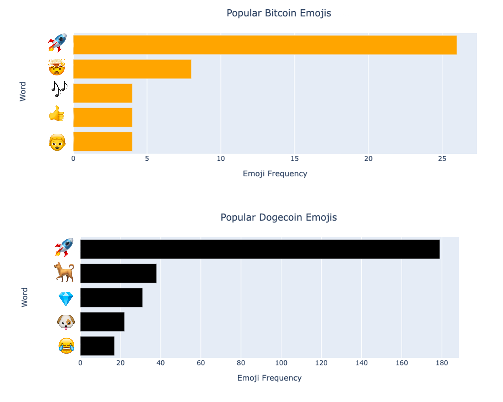

# Project 3: Reddit NLP and Webscraping

### Problem Statement

The goal of this project was to utilize Python, machine learning, APIs, and NLP. Using Pushshift's API, I was required to collect posts from -r/Bitcoin and -r/Dogecoin. I then needed to use NLP to train a classifier to determine which subreddit a given post came from, thus making this a binary classification problem. Specifically, the models I used for classifcation were as follows: Logistic Regression, KNeighborsClassifier, DecisionTreeClassifier, BaggingClassifier, RandomForestClassifier, AdaBoostClassifier, and GradientBoostingClassifier. The success of the models were evaluated based on accuracy scores. 

In my presentation, I focused on addressing the following two questions: 
- Are we able to classify whether a given post belongs to -r/Bitcoin or -r/Dogecoin?
- Which features impact our classification model and what do these tell us about Reddit Bitcoin users and Reddit Dogecoin users?

Note: The audience of this project is intended to be a semi-technical audience.

In short, my goal was to correctly classifiy a given post using classifying models and to understand what the features (and feature importances) tell me about Reddit Bitcoin users and Reddit Dogecoin users.

### Executive Summary

I began by gathering the data from -r/Bitcoin and -r/Dogecoin using Pushshift Reddit API. I combined all the data into one dataframe. I then cleaned the data by dealing with empty values, feature engineering, creating emoji columns, and removing unnneeded characters. Next, I explored the distribution and differences in the word counts, word frequency, emoji counts, and emoji frequency using plotly's histograms, bar charts, and box plots. Lastly, I tested 7 different models with 2 features, clean_title_and_text and clean_emoji, to attempt to correctly classify the posts.

Below you can find a graph that demonstrates the most popular emojis used in each subreddit: 

### Contents:

Part I: Gathering Data
- Import Libraries
- Function to Get Pushshift Data
- Function to Get Crypto Coin Data
- Combine Bitcoin and Dogecoin Data
- Emport to CSV

Part II: Cleaning
- Import Libraries
- Read In & Inspect Data
- Deal with NaN Values
- Feature Engineering
- Create Emoji Columns
- Remove Unnecessary Characters with RegEx
- Emojo to Text
- Save to CSV File

Part III: Exploratory Data Analysis
- Import Libraries¶
- Read In & Inspect Data
- Analyze Word Counts
- Analyze Frequent Words
- Analyze Emoji Counts
- Analyze Frequent Emojis

Part IV: Modeling
- Import Libraries
- Null Model
- Model Functions for Efficiency
- Testing Models
- Bagging
- Random Forest
- Conclusion

Part V: Scratch Work

### Data Dictionary

|Feature|Type|Description|
|---|---|---|
|year|*int*|which year the post came from| 
|is_btc|*int*|1 if the post is from r/Bitcoin and 2 if the post is from r/Dogecoin| 
|text_word_count|*int*|the count of words in the post text| 
|title_word_count|*int*|the count of words in the post title| 
|total_word_count|*int*|the count of words in the post text and title|
|emoji|*object*|the emojis in the post|
|emoji_count|*int*|the count of emojis in the post|
|clean_text|*object*|the text of post|
|clean_title|*object*|the title of the post|
|clean_title_and_text|*object*|the title and text of the post|
|clean_emoji|*object*|the emojis in the post converted to text|

### Conclusion

I ended up setting my X value to two features: clean_title_and_text and clean_emoji. My best models ended up being **Bagging Classifier with Count Vectorizer**, which got a score of 0.903, and **Random Forest with TfidfVectorizer**, which got a score of 0.900. I used Random Forest to interpret feature importances. I found the **most important features to be the following: bitcoin, doge, dogecoin, and emoji_nan.** In other words, these four features are most significant to the model when determining whether a post is from Dogecoin or Bitcoin. It is understandable that the words bitcoin, doge, dogecoin, and emoji_nan play a big role in classifying the posts, however, understanding why emoji_nan plays an important role in the classification may not be as clear. Upon analyzing the frequency of emojis used, I found that in this dataset emojis ares used .03% of the time in Bitcoin posts and 20% of the time in Dogecoin posts. One last insight I would like to mention is that Bitcoin Reddit authors tend to post lengthier posts than Dogecoin authors. Perhaps, these two findings could be due to the fact that Dogecoin users are a younger audience. 

In summary Bagging Classifier with Count Vectorizer and Random Forest with TfidfVectorizer ended up being my most effective models, with bitcoin, doge, dogecoin, and emoji_nan being my most significant features. 

### Furhter Study

If I had more time to complete the project, I would have liked to incorporate the following two models to test if they would have any improvements with the test scores: Gradient Boost and Histogram Gradient Boost. In addition, I would have liked to try RandomizedSearchCV for faster iteration, as Grid Search was very slow. Lastly, it would have been interesting to add more words to my stop words list, such as doge, dogcoin, and bitcoin. Taking these out would have lowered my accuracy score, but it would be interesting to see how much it would have negatively affected the model. 

### Sources
https://github.com/pushshift/api

https://stackoverflow.com/questions/43146528/how-to-extract-all-the-emojis-from-text

https://plotly.com/python/bar-charts/
